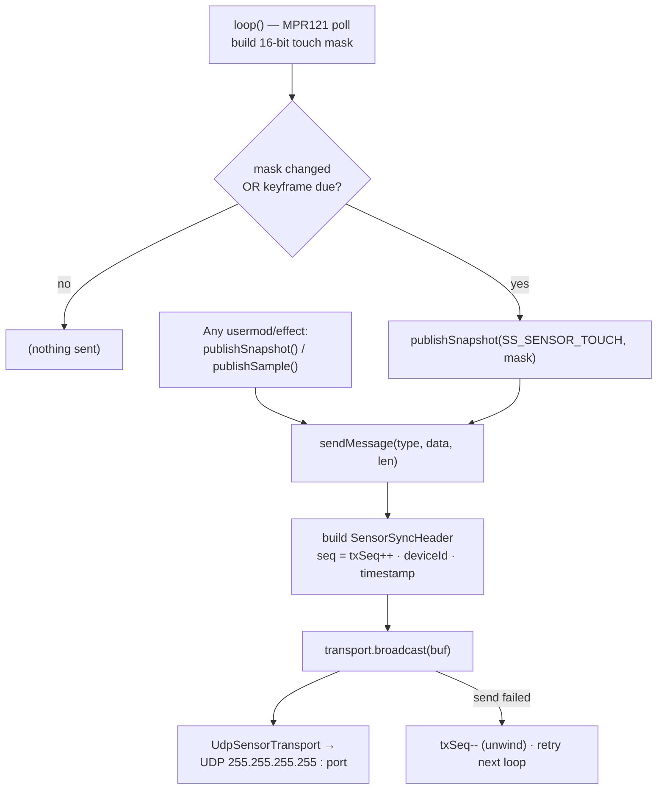
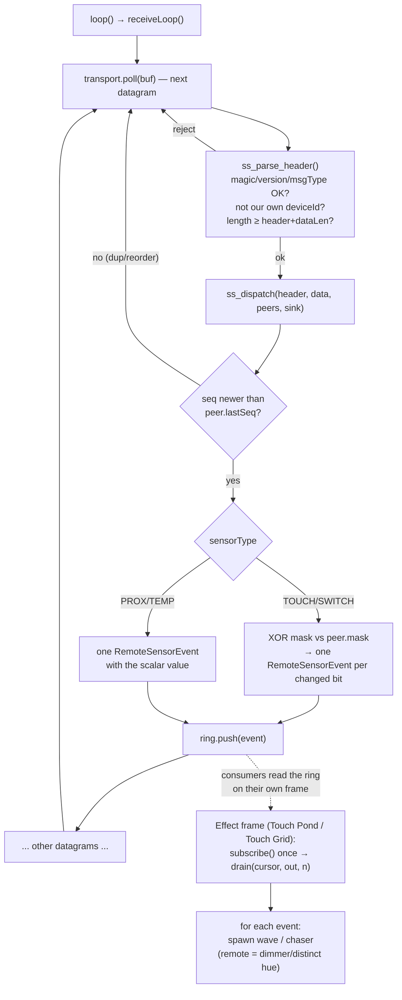

# SensorSync — cross-device sensor event bus

Engineer-oriented guide to how the AMPWorks **SensorSync** bus works and is structured.
Keep this document in sync with the code — update it in the same PR whenever the wire
format, the dispatch logic, the consumer/producer API, or the transport changes.

## What it is

SensorSync lets multiple WLED devices on the same LAN share sensor activity **without a
router or broker**. A device broadcasts a full snapshot of its local sensor state (e.g. which
MPR121 electrodes are touched); peers receive the snapshot, derive discrete events (a press, a
release, a proximity/temperature sample) and hand them to effects. This is the substrate for
the installation's "touch on one device ripples across all devices" behavior.

Design goals: sensor-agnostic (touch, switches, proximity, temperature, …), tolerant of packet
loss (snapshot model self-heals), multi-consumer (several effects/segments each see every
event), and transport-swappable (UDP, ESP-NOW single-hop, or multi-hop via the router tier).

## File map

| File | Role |
|------|------|
| `sensor_sync_protocol.h` | **Pure** wire format + logic. No WLED/Arduino deps (only `<stdint.h>`/`<string.h>`). Structs, `ss_parse_header`, `ss_dispatch`, and the multi-consumer `SensorEventRing`. This is what the host test compiles. |
| `usermod_sensor_sync.h` / `.cpp` | The WLED **usermod**: wires the pure protocol to a transport (`UdpSensorTransport`), the local producer (MPR121 poll + keyframe), config, and the consumer-facing `subscribe()`/`drain()` API. |
| `tests/sensor_sync_test.cpp` | Host unit test — includes only `sensor_sync_protocol.h`; builds with a stock `c++` compiler. |
| `ampworks.cpp` (consumers) | Effects **Touch Pond** and **Touch Grid** consume the bus: each holds its own `SensorCursor` in `SEGENV` data and `drain()`s remote events to spawn waves/chasers. |

The pure/impure split is deliberate: all protocol logic (parsing, edge derivation, dedup, the
ring) lives in the dependency-free header so it can be unit-tested off-device.

## Wire format

Every datagram is a 20-byte `SensorSyncHeader` followed by a per-type data struct
(`header.dataLen` bytes). `SENSOR_SYNC_VERSION = 5`.

```
SensorSyncHeader (20B): magic "AMPS" | version | msgType | sensorType | dataLen
                        | deviceId(u32) | seq(u16) | ttl(u8) | flags(u8) | timestamp(u32)
```

`msgType` is `SENSOR_SYNC_MSG_SNAPSHOT` (0) for sensor data. Every higher number is a single-hop
router control frame — `SENSOR_SYNC_MSG_BEACON` (1) leader election, `SENSOR_SYNC_MSG_ROUTER_ADV`
(2) a router's routing metric, `SENSOR_SYNC_MSG_ATTACH` (3) / `SENSOR_SYNC_MSG_ATTACH_ACK` (4) the
attach handshake — and only a snapshot is ever relayed. Edges reject all of them via
`ss_parse_header`'s msgType check. The
`ttl`/`flags` bytes occupy the former `reserved` u16 — still v5, still 20 bytes; legacy senders
zeroed `reserved`, so old frames arrive `ttl=0` (a relay injects the default). See **Multi-hop
backbone** below.

| `sensorType` | payload | semantics |
|--------------|---------|-----------|
| `SS_SENSOR_TOUCH` (0)     | `SensorSnapshot{ u16 mask }` | bit *e* = electrode *e* active; **edge-derived** |
| `SS_SENSOR_SWITCH` (1)    | `SensorSnapshot{ u16 mask }` | bit *e* = switch *e* closed; **edge-derived** |
| `SS_SENSOR_PROXIMITY` (2) | `SensorSample{ u8 ch; i16 value }` | proximity level 0..255; delivered as-is |
| `SS_SENSOR_TEMP` (3)      | `SensorSample{ u8 ch; i16 value }` | temperature in centi-°C; delivered as-is |

`deviceId` is a 32-bit FNV-1a hash of the full MAC (override via the `id` config field). The
header/touch layout is unchanged from version 5, so older builds still interoperate for touch;
new sensor types are additive (an older peer ignores a `sensorType` it doesn't know).

## Data model

- **Snapshot, not deltas.** Producers send the *entire* current state on change. A dropped
  datagram self-corrects on the next snapshot — no permanent edge loss. This is why edge
  derivation lives on the **receiver**.
- **Edge derivation (bitmask sensors).** The receiver keeps the last mask per peer and XORs the
  new mask against it, emitting one event per changed bit (value 1 = became active, 0 = released).
- **Scalar sensors** (proximity/temp) aren't edge-derived — the sample is delivered directly.
- **Dedup.** Each peer's last `seq` is tracked; a snapshot whose `seq` is not newer
  (RFC-1982 wraparound-safe) is dropped, so relay/retransmit duplicates don't double-fire.
- **Keyframe.** Producers re-broadcast the current snapshot every `keyframeMs` (config, default
  3 s, 0 = off) so a node that booted mid-touch, or missed a change during loss, resyncs.
- **Peer aging.** Peer state idle > 30 s is freed (`sweepPeers`) so departed devices don't hold slots.

## Send path (producer)



The MPR121 poll is the built-in producer; `publishSnapshot`/`publishSample` are public so any
other usermod or effect can emit onto the same bus (switches, proximity, temperature, …).

## Receive + act path (consumer)



Receiver logic (`ss_parse_header` + `ss_dispatch`) is pure and host-tested. Events land in a
monotonic ring; consumers read via cursors (below).

## Consumer API (per-consumer cursors)

Each consumer holds its own `SensorCursor` (typically in its `SEGENV` data, zero-initialized so
it subscribes lazily on the first frame). Multiple segments/effects therefore each see **every**
event — no single global drain contention. A consumer that falls more than the ring capacity
behind skips the overwritten gap rather than blocking the producer.

```cpp
UsermodSensorSync *ss = (UsermodSensorSync*) UsermodManager::lookup(USERMOD_ID_SENSOR_SYNC);
if (ss) {
  if (!data->remoteSubscribed) { data->remoteCursor = ss->subscribe(); data->remoteSubscribed = true; }
  RemoteSensorEvent ev[8];
  uint8_t n;
  while ((n = ss->drain(data->remoteCursor, ev, 8)) > 0)
    for (uint8_t i = 0; i < n; i++)
      if (ev[i].sensorType == SS_SENSOR_TOUCH && ev[i].value) { /* act on it */ }
}
```

## Producer API

```cpp
ss->publishSnapshot(SS_SENSOR_SWITCH, mask);          // bitmask sensors (edge-derived by peers)
ss->publishSample(SS_SENSOR_TEMP, channel, centiDeg); // scalar sensors (delivered as-is)
```

## Transport seam

`ISensorTransport { begin/end/broadcast/poll }` isolates the wire. Two implementations sit behind
it: `UdpSensorTransport` (UDP limited broadcast, the default) and `EspNowSensorTransport` (ESP-NOW
broadcast, selected by the `useEspNow` config); multi-hop delivery is layered on by the router
tier. Packet-boundary handling stays inside each implementation, so producers, consumers, and
dispatch are unaffected by the choice.

## Testing

```bash
cd usermods/ampworks
c++ -std=c++11 -Wall -Wextra -o /tmp/ss_test tests/sensor_sync_test.cpp && /tmp/ss_test
```

The host test exercises the pure protocol: edge derivation, seq dedup + wraparound, self-packet
rejection, short-`dataLen` rejection, proximity/temperature scalars, switch edges, unknown-type
ignore, and the ring's two-consumer independence + lag-skip. On-device (multi-device hardware)
verification is tracked as `## Testing Required` on the task.

## Extending

- **New sensor type:** add an `SS_SENSOR_*` tag + (if needed) a data struct in
  `sensor_sync_protocol.h`, add a branch to `ss_dispatch`, add a host test case, and a
  `publish*` call from the producer. No header/version change if the layout is unchanged.
- **New consumer:** look up the usermod, `subscribe()` once (store the cursor in your effect's
  state), `drain()` each frame. Filter by `sensorType`/`channel`.

## Multi-hop backbone

Single-hop ESP-NOW only reaches edges in direct radio range. A tier of dedicated
non-WLED **router** nodes relays `AMPS` frames multi-hop, so an event injected at one edge
reaches every edge even across an installation. The router firmware lives in its own repo
(`esp-now-router`, a sibling submodule of `WLED_dev`) and includes this header directly, so the
wire format cannot drift.

The router-only helpers (`ss_router_should_relay`, `ss_router_relay_slot`,
`ss_router_beacon_better`, `SensorRouterPeer`, plus the membership table and route selection) live
in the router repo (`esp-now-router/src/router_relay.h`, `router_election.h`, `router_attach.h`),
not in this header — the edge firmware never calls them. They are tested from that repo
(`esp-now-router/tests/`); this repo's host tests cover the edge dispatch it uses. Only the wire
format is shared: the header fields, the msgType numbers, and the attach payload structs
(`RouterAdvert`, `NodeAttach`, `AttachAck`) that both sides parse.

- **Relay** — `ss_router_should_relay(header, selfId, seenTable, n, &outTtl)` (pure, host-tested): a
  loop-free flood. Per-origin `seq` dedup (`ss_seq_newer`) terminates loops; `ttl` (origin stamps
  `SS_DEFAULT_TTL`, each hop decrements, drop at ≤1) bounds diameter; a self-origin frame is never
  relayed. Frames arriving with `ttl==0` (a sender predating the field) get the default injected, so they still propagate.
- **Leader election** — routers beacon `{uptimeTicks, term}` (`SENSOR_SYNC_MSG_BEACON`);
  `ss_router_beacon_better` picks the highest `(uptimeTicks, deviceId)` as timebase leader, with
  step-down + reassert. Degenerates cleanly to a single router.
- **Attach + failover** — a router advertises `RouterAdvert{leaderId, leaderTerm, hopCost,
  memberCount}`; a node binds to the router with the fewest hops to the leader (then least loaded,
  then highest `deviceId`) and holds the binding with periodic `NodeAttach` keepalives that the
  router answers with an `AttachAck` lease. A silent router is dropped on a heartbeat timeout and
  the next advertisement heard replaces it. Relaying continues throughout, and an edge that missed
  a transition during the churn is re-synced by the next `keyframeMs` snapshot.

  **This repo reserves the format only.** `ss_parse_header` accepts `SENSOR_SYNC_MSG_SNAPSHOT`
  alone, so a WLED edge ignores all three attach msgTypes: the handshake currently runs
  router-to-router, and edges reach the mesh as plain snapshot senders rather than as attached
  members. The numbers and structs live here so the edge can implement the client half later
  without a wire change.

Router design + go/no-go notes and the relay/election/attach host tests live in the
`esp-now-router` repo (`BACKBONE_ROUTER.md`, `tests/`).

## Maintenance

This README is the human-facing map of the bus. **Update it in the same change** that alters the
wire format, `ss_dispatch`, the producer/consumer API, the transport, or the sensor-type table
above. The code headers point here; keep the flowcharts accurate.
